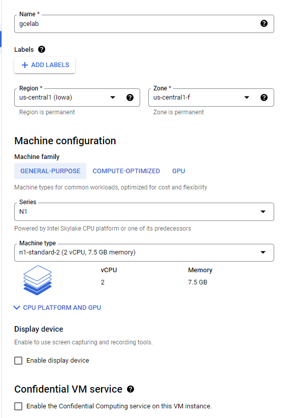

# GSP001


## Overview
Compute Engine을 사용하면 Google의 인프라상에서 다양한 Linux(Debian, Ubuntu, Suse, Red Hat, CoreOS), Window Server 등 서로 다른 운영체제가 실행되는 가상 머신을 만들 수 있다. 속도가 바르고 일관적인 성능을 제공하도록 설계된 시스템에서 수천 개의 가상 CPU를 실행할 수 있다.

이번 실습에서는 Google Cloud Console 및 gcloud 명령줄을 사용하여 다양한 머신 유형의 가상 머신 인스턴스를 만든다. 가상 머신에 NGINX 웹 서버를 연결하는 방법도 배울 것이다.

## 실습할 내용
1. Cloud Console을 사용하여 가상 머신 만들기
2. gcloud 명령줄을 사용하여 가상 머신 만들기
3. 웹 서버를 배포하고 가상 머신에 연결하기

## 설정
이 실습을 완료하려면 다음의 준비가 필요하다
1. 표준 인터넷 브라우저(Chrome 브라우저 권장)
2. Chrome OS 기기를 사용하는 경우 시크릿 창을 열어 실습을 실행한다.

## Google Cloud Shell 활성화하기
Google Cloud Shell은 다양한 개발 도구가 탑재된 가상 머신으로, 5GB의 영구 홈 디렉토리를 제공하며 Google Cloud에서 실행된다.
Google Cloud Shell을 사용하면 명령줄을 통해 GCP 리소스에 액세스할 수 있다.

1. GCP Console 열기

2. GCP Console의 오른쪽 상단 툴바에서 Cloud Shell 열기 버튼을 클릭한다.

3. Continue를 클릭한다.
- 환경을 프로비저닝하고 연결하는 데 시간이 약간 걸린다. 연결되면 이미 인증되었으며 프로젝트는 PROJECT_ID로 설정된다.
- gcloud는 Google Cloud Platform의 명령줄 도구이다. Cloud Shell에 사전 설치되어 있으며 탭 자동 완성을 지원한다.

- 목록 표시
```
gcloud auth list
```

- 출력 예
```
Credentialed accounts:
- google1623327_student@qwiklabs.net
```

- 프로젝트 ID 목록 표시
```
gcloud config list project
```

- 출력:
```
[core]
project = qwiklabs-gcp-44776a13dea667a6
```

gcloud 관련 전체 설명서는 [Google Cloud gcloud](https://cloud.google.com/sdk/gcloud) 개요에서 확인할 수 있다.

## Understanding Regions and Zones

일부 Compute Engine 리소스는 Region 이나 Zone에 있다. Region은 리소스를 실행할 수 있는 특정 지리적 위치이다. 각 Region에는 하나 이상의 Zone이 있다. 예를들어 us-central1 Region은 us-central1-a, us-central1-b, us-central1-c 및 us-central1-f Zone 이 있는 미국 중부의 Region을 나타낸다.

영역 내에 상주하는 리소스를 영역별 리소스라고 한다. 가상 머신 인스턴스와 영구 디스크는 영역에 상주한다. 영구 디스크를 가상 머신 인스턴스에 연결하려면 두 리소스가 모두 같은 영역에 있어야 한다. 마찬가지로 인스턴스에 정적 IP 주소를 할당하려는 경우 인스턴스가 정적 IP와 같은 리전에 있어야 한다.

- 인스턴스(instance): 같은 클래스에 속하는 개개의 객체로, 하나의 클래스에서 생성된 객체를 말한다. 즉 클래스가 구체화 되어, 클래스에서 정의된 속성과 성질을 가진 실질적인 객체로 표현된 것을 의미한다. 이때 추상적인 개념인 클래스에서 실제 객체를 생성하는 것을 인스턴스화(instantiation)라고 한다. 여기서 인스턴스는 Google 인프라에서 호스팅되는 가상 머신(VM)이다. GCC, CLI, Compute Engine API를 사용하여 단일 인스턴스를 만들거나 관리형 인스턴스 그룹을 만들 수 있다.

- 영구 디스크
    - 영역 영구 디스크: 안정적이고 효율적인 블록 스토리지
    - 리전 영구 디스크: 두 영역에 복제되는 리전 블록 스토리지

- 리소스(Resource): 중앙처리장치나 자기테이프 등의 주변장치, 단말 장치를 가리킨다. 즉, 컴퓨터 시스템에 관한 여러 가지 자원을 총칭하는 말이며, 기억장치의 에어리어/중앙처리장치의 처리시간 등 부터 넓은 의미로 컴푸터 시스템에 종사하는 인력을 포함하는 경우도 있다.

## 작업 1: Cloud Console에서 새 인스턴스 만들기
1. Cloud Console의 탐색 메뉴에서 Compute Engine > VM 인스턴스를 클릭한다.
2. 새 인스턴스를 만들려면 인스턴스 만들기를 클릭한다.
3. 새 인스턴스를 만들 때 다양한 매개변수를 구성할 수 있다.


4. 만들기를 클릭한다.
- 새 가상 머신이 VM인스턴스 페이지에 나열된다.

5. SSH를 사용하여 가상 머신에 연결하려면 머신이 표시된 행에서 SSH를 클릭한다.
- 그러면 브라우저에서 직접 SSH 클라이언트가 실행된다.


## 작업 2: NGINX 웹 서버 설치
1. SSH 터미널에서 root 액세스 권한을 확보하려면 다음 명령어를 실행한다.
```
sudo su -
```

2. root 사용자로서 OS를 업데이트한다.
```
apt-get update
```

예상 출력:
```
Get:1 http://security.debian.org stretch/updates InRelease [94.3 kB]
Ign http://deb.debian.org strech InRelease
Get:2 http://deb.debian.org strech-updates InRelease [91.0 kB]
...
```

3. NGINX를 설치한다.
```
apt-get install nginx -y
```

예상 출력:
```
Reading package lists... Done
Building dependency tree
Reading state information... Done
The following additional packages will be installed:
...
```

4. NGINX가 실행 중인지 확인한다.
```
ps auwx | grep nginx
```

예상 출력:
```
root      2330  0.0  0.0 159532  1628 ?        Ss   14:06   0:00 nginx: master process /usr/sbin/nginx -g daemon on; master_process on;
www-data  2331  0.0  0.0 159864  3204 ?        S    14:06   0:00 nginx: worker process
www-data  2332  0.0  0.0 159864  3204 ?        S    14:06   0:00 nginx: worker process
root      2342  0.0  0.0  12780   988 pts/0    S+   14:07   0:00 grep nginx
```

5. 웹페이지를 보려면 Cloud Console로 돌아와 머신이 표시된 행에서 외부 IP 링크를 클릭 하거나, 새 브라우저 창 또는 탭에서 외부 IP 값을 http://EXTERNAL_IP/에 추가한다.

6. 그러면 기본 웹페이지가 열린다.


## 작업 3: gcloud를 사용하여 새 인스턴스 만들기
Cloud Console을 사용하여 가상 머신 인스턴스를 만드는 대신 Google Cloud Shell에 사전 설치되어 있는 명령줄 도구 gcloud를 사용할 수 있다.
Cloud Shell은 필요한 모든 개발 도구(gcloud, git 등)가 로드된 Debian 기반 가상 머신으로, 5GB의 영구적인 홈 디렉터리를 제공한다.
1. Cloud Shell에서 gcloud를 사용해 명령줄에서 새 가상 머신 인스턴스를 만든다.
```
gcloud compute instances create gcelab2 --machine-type n1-standard-2 --zone us-central1-f
```

새 인스턴스의 기본값은 다음과 같다.
- 최신 Debian 10(buster)이미지
- n1-standard-2 머신 유형: Qwiklabs 외부에서 프로젝트를 진행할 때는 커스텀 머신 유형을 지정할 수도 있다.
- 인스턴스와 같은 이름을 가진 루트 영구 디스크: 자동으로 인스턴스에 연결되는 디스크

2. 모든 기본값을 보려면 다음 명령어를 실행한다.
```
gcloud compute instances create --help
```

> 항상 하나의 리전 또는 영역 내에서 작업하며 매번 --zone 플래그를 추가하고 싶지 않다면 gcloud에서 사용할 기본 리전과 영역을 설정할 수 있다. 그러면 다음 명령어를 실행한다.
```
gcloud config set compute/zone . . .
gcloud config set compute/region . . .
```

3. help를 종료하려면 Ctrl+C를 누른다.

4. Cloud Console의 탐색 메뉴에서 Compute Engine > VM 인스턴스를 클릭한다. 새 인스턴스 2개가 나열된다.

5. SSH를 사용하여 gcloud를 통해 인스턴스에 연결할 수도 있다. 이 경우 영역을 추가해야 하며, 옵션을 전역으로 설정한 경우에는 --zone 플래그를 생략해야 한다.
```
gcloud compute ssh gcelab2 --zone us-central1-f
```

6. Y를 입력하여 계속 진행한다.

7. 암호 섹션에서는 계속 Enter 키를 눌러 공백으로 둔다.

8. 연결 후에는 원격 셀을 종료하여 SSH 연결을 끊는다.