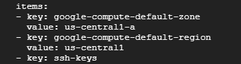

# Getting Started with Cloud Shell and gcloud

## 작업 1: 환경 구성하기

### 기본 리전 및 영역 식별하기
1. 프로젝트 ID를 클립보드에 복사한다.
2. Cloud Shell에서는 다음 gcloud 명령어를 실행하여 <your_project_ID>를 복사한 프로젝트 ID로 바꾼다.
```
gcloud compute project-info describe --project <your_project_ID>
```

출력에서 기본 영역 및 리적 메타데이터 값을 찾는다. 
> `google-compute-default-region` 및 `google-compute-default-zone` 키와 값이 출력에서 빠져 있는 경우 기본 영역이나 리전이 설정되지 않은 것임.

### 환경 변수 설정
환경을 정의하는 환경 변수는 API 또는 실행 파일이 포함된 스크립트를 작성할 때 시간을 절약하는 데 도움이 된다.

1. 프로젝트 ID를 저장할 환경 변수를 만들고 <your_project_ID>를 이전에 실행한 'gcloud compute project -info describe'명령어의 이름에 해당하는 값으로 바꾼다.

```
export PROEJCT_ID=<your_project_ID>
```

2. 영역을 저장할 환경 변수를 만들고 <your_zone>을 이전에 실행한 'gcloud compute project-info describe' 명령어의 영역에 해당하는 값으로 바꾼다.

```
export ZONE=<your_zone>
```

3. 변수가 적절하게 설정되었는지 확인하려면 다음 명령어를 실행한다.

```
echo $PROJECT_ID
echo $ZONE
```

변수가 올바르게 설정된 경우 echo 명령은 프로젝트 ID와 영역을 출력한다.

### gcloud 도구로 가상 머신 만들기
1. VM을 만들려면 다음 명령어를 실행하고 ZONE을 이전 명령어의 영역에 해당하는 값으로 바꾼다.

```
gcloud compute instances create gcelab2 --machine-type n1-standard-2 --zone $ZONE
```

실행 결과는 다음과 같다.

#### 명령어 세부정보
- 'gcloud compute'를 사용하면 Compute Engine API보다 간단한 형식으로 Compute Engine 리소스를 관리할 수 있다.
- 'instances create'는 새 인스턴스를 만든다.
- 'gcelab2'는 VM의 이름이다.
- '--machine-type' 플래그는 머신 유형을 n1-standard-2로 지정한다.
- '--zone' 플래그는 VM이 생성되는 위치를 지정한다.
    - '--zone' 플래그를 생략하면 gcloud 도구가 기본 속성을 기준으로 개발자가 원하는 영역을 추론한 수 있다. machine type 및 image와 같은 기타 필수 인스턴스 설정은 create 명령어에서 지정되지 않은 경우 기본값으로 설정된다.

> 'create'에 대한 도움말을 열려면 다음 명령어를 실행한다.
> ```
> gcloud compute instances create --help
> ```

### gcloud 명령어 살펴보기
gcloud 도구에서는 gcloud 명령어 끝에 -h 플래그(도움말)를 추가하면 참고할 수 있는 간단한 사용 가이드라인을 제공한다.
```
gcloud -h
```
아래 두 명령어의 결과는 같다.
```
gcloud config --help
gcloud help config
```
> 도움말 컨텐츠를 벗어나려면 q를 입력하면 된다.

환경에서 구성 목록 보기
```
gcloud config list
```

모든 속성과 각 설정 확인하기
```
gcloud config list --all
```

구성요소 나열하기
```
gcloud components list
```

## 작업 2: 새 구성요소 설치하기
### 자동 완성 모드
'gcloud interactive'는 명령어 및 플래그를 자동으로 추천하고 명령어 입력 시 창의 하단에 인라인 도움말 스니펫을 표시한다.

드롭다운 메뉴를 사용해서 명령어 및 하위 명령어 이름과 같은 정적 정보와 플래그 이름 및 열거형 플래그 값을 자동으로 완성할 수 있다.

베타 구성요소 설치하기
```
sudo apt-get install google-cloud-sdk
```

gcloud interactive 모드를 사용 설정하기
```
gcloud beta interactive
```

대화형 모드를 사용하는 경우 Tab 키를 눌러 파일 경로 및 리소스 인수를 입력한다. 드롭다운 메뉴가 나타나면 Tab 키를 눌러 목록에서 이동하고 스페이스바를 사용하여 원하는 항목을 선택한다.

자동 완성 기능을 사용하여 <your_vm>을 프로젝트의 기존 VM으로 바꿔보자.
```
gcloud compute instances describe <your_vm>
```
명령어 목록은 Cloud Shell 창 아래에 표시된다. F2 키를 누르면 활성 도움말 섹션을 ON 또는 OFF로 전환시킨다.

## 작업 3: SSH를 사용하여 VM 인스턴스에 연결하기
'gcloud compute'를 사용하면 인스턴스에 쉽게 연결할 수 있다. 'gcloud compute ssh' 명령어는 SSH에 래퍼 기능을 제공하여 인증 및 인스턴스 이름과 IP 주소의 매핑을 처리하게 한다.

1. SSH를 사용하여 VM 인스턴스에 연결하기
```
gcloud compute ssh gcelab2 --zone $ZONE
```
2. 계속하려면 Y를 입력한다.
3. 암호를 비워두려면 Enter 키를 누른다.
4. SSH 연결을 끊고 원격 셀을 종료하려면 다음 명령을 실행한다.
```
exit
```

## 작업 4: 홈 디렉터리 사용하기
Cloud Shell 홈 디렉터리의 콘텐츠는 가상 머신을 종료했다가 다시 시작하더라도 모든 Cloud Shell 세션의 프로젝트에서 그대로 유지된다.

1. 현재 작업 디렉터리 변경하기
```
cd $HOME
```

2. vi 텍스트 편집기를 사용하여 .bashrc 구성 파일 열기
```
vi ,.,bashrc
```

3. 편집기를 종료하려면 ESC 키를 누른 다음 :wq를 실행한다.


